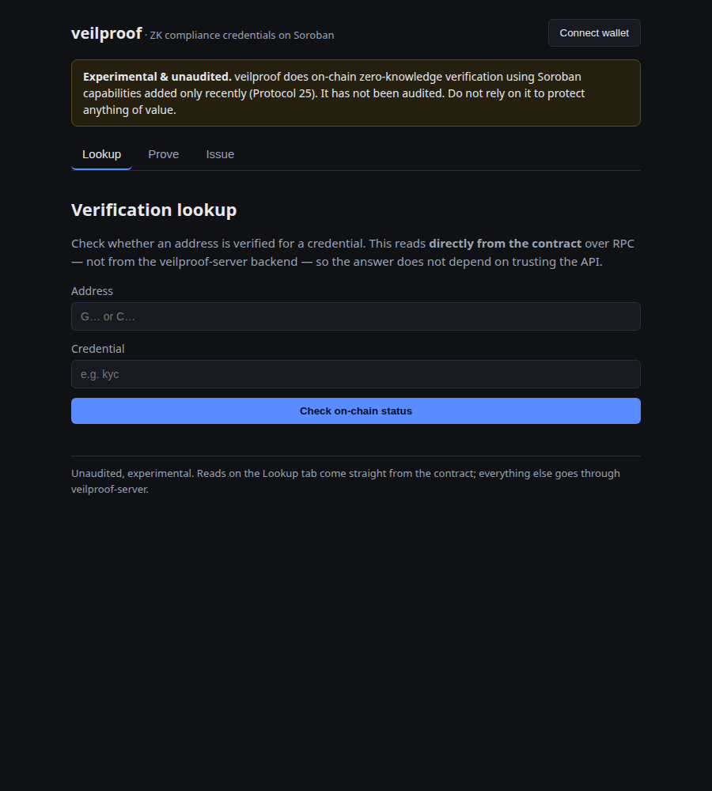
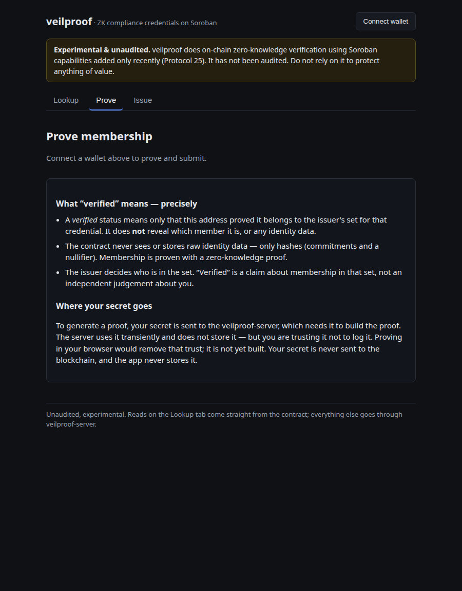

# veilproof-web

The web dashboard for **veilproof**, the Soroban zero-knowledge
compliance-credential suite. It's the human layer over the API-and-contract-only
[veilproof-server][server] and [veilproof-registry][registry]:

- **Issuers** manage a credential tree (add commitments, publish its root on-chain).
- **Holders** generate a membership proof and submit it on-chain to become
  _verified_ for a credential — without revealing their identity.
- **Anyone** can look up whether an address is verified for a credential, read
  **directly from the contract**.

> **Experimental & unaudited.** veilproof does on-chain ZK verification using
> Soroban capabilities added only recently (Protocol 25). It has not been
> audited. Don't rely on it to protect anything of value.



## The privacy & trust model, precisely

This is the part that matters, and the UI states it plainly rather than
implying more:

- **A "verified" status reveals only membership.** It means the address proved
  it belongs to the issuer's set for that credential. It does **not** reveal
  _which_ member, or any identity data.
- **The contract never sees raw identity data** — only hashes (leaf commitments
  and a nullifier). Membership is proven with a Groth16 zero-knowledge proof.
- **Your secret is sent to veilproof-server** to generate the proof — that is
  where proving happens. The server uses it transiently and does not store it,
  but you are trusting it not to log it. Proving in the browser would remove
  that trust and is future work. The app itself never stores the secret, and the
  secret never goes on-chain.
- **The issuer defines the set.** "Verified" is a claim about membership in the
  issuer's set, not an independent judgement about a person.

The proof is also **bound to the holder's address**, so a proof seen in transit
can't be replayed by someone else.



## Independent on-chain reads

The verification lookup does **not** trust this project's own backend. It reads
`is_verified` straight from the veilproof-registry contract over Soroban RPC
(`src/chain/reads.ts`), separate from the `src/api` client that talks to
veilproof-server. So the answer to "is this address verified?" comes from the
chain, not from a cache the backend controls.

## Tech

- **TypeScript + React 19 + Vite 8**, Vitest for tests.
- **`@stellar/stellar-sdk` 17** for on-chain reads and building/submitting the
  `verify_credential` / `publish_root` invocations.
- **`@creit.tech/stellar-wallets-kit` 2.6** for wallet connection (Freighter,
  xBull, and others through one interface).

## Quickstart

Requires a running [veilproof-server][server] and a deployed
[veilproof-registry][registry] on the network you configure.

```sh
npm install
cp .env.example .env.local     # set the values below
npm run dev                    # http://localhost:5173
```

Then: **Issue** a tree (add commitments, publish the root from the issuer
wallet), **Prove** membership as a holder (generate a proof, submit it), and
**Lookup** any address's on-chain status.

## Configuration

All config is public (no secrets), read from `VEILPROOF_*` env vars at build
time. See `.env.example`.

| Variable                         | Meaning                                              |
| -------------------------------- | ---------------------------------------------------- |
| `VEILPROOF_API_URL`              | veilproof-server base URL                            |
| `VEILPROOF_REGISTRY_CONTRACT_ID` | deployed veilproof-registry contract id (`C…`)       |
| `VEILPROOF_RPC_URL`              | Soroban RPC endpoint (for the direct on-chain reads) |
| `VEILPROOF_NETWORK_PASSPHRASE`   | network the contract is on                           |

## Layout

```
src/config.ts     public config from env
src/api/          typed client for veilproof-server (the only path to the backend)
src/chain/        reads.ts (direct on-chain reads), submit.ts (wallet-signed writes), wallet.ts
src/components/   TrustNotice (the honest privacy copy), WalletBar
src/pages/        Lookup, Holder (Prove), Issuer
tests/            Vitest — API client, the lookup view, and guards on the trust copy
```

## Screenshots

- `docs/screenshots/lookup.png` — the verification lookup (direct on-chain read).
- `docs/screenshots/prove.png` — the holder flow with the full trust notice.

## Scripts

```sh
npm run dev       # dev server
npm run build     # type-check + production build
npm test          # Vitest
npm run lint      # eslint + prettier --check
npm run format    # prettier --write
```

## License

Apache-2.0 — see [LICENSE](LICENSE).

[server]: https://github.com/veilproof/veilproof-server
[registry]: https://github.com/veilproof/veilproof-registry
